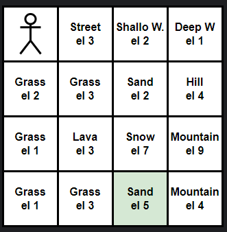
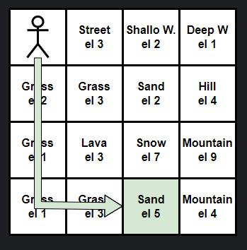
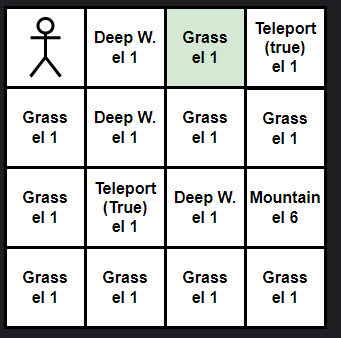
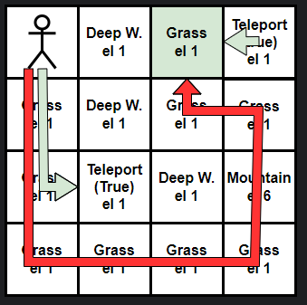

# Shortest path GPS:
This tool garantee you to find the shortest path to a specific block known. 
In fact, by using the ```robot_map``` function (the map that the robot has already seen),
we are going create the shortest path to the position selected. \

## Functions:
The **GPS**, which will find the shortest path based on your request: \
```pub fn gps( robot: &impl Runnable, dest: Goal, world: &World, opt_teleports: Option<&[(usize, usize)]>,)``` \
```-> Option<(Vec<Command>, usize)>; ```


The **research**, this is the most complete between our functions, which will find the shortest path, and it will execute all the commands 
to reach the position, or destroy the content specified: \
```pub fn research(dest: Goal,opt_teleports:Option<&[(usize, usize)]>,robot:&mut impl Runnable ``` \
``` ,world:&mut World)-> Result<(), LibError> ```

### Functionality:
- Find and reach a coordinate, by finding the shortest path to it.
- Find and destroy a content you decide. In fact, by giving a Content to the tool he will find
  the path to the closest Content to him.


## Here there are a few examples: (We also have the code 😉)
***In the next test we will consider that the robot has already explored all the world, so
the ```robot_map``` function can see every block.***

## Example number 1:
In the file ```show_example1.rs``` we implemented a really simple world:

<p align="center">
    
</p>

If we want to go to the destination at the coordinates```(3,2)``` we can have multiple
path to got there. \
Our algorithm will manage to find the **best path** to arrive at the specified position, trying to **lose
as little energy as possible**.

The best path for reaching the block is the one in the picture below:

<p align="center">
    
</p>

**Our robot is not limited to find the path to a specific position, but also to search the closest Content to him.
So, we can tell him to search for a Rock and he will manage to find the path to the closest rock to him.** \
Since the previous example was easier, we also got something more challenging for our robot.
## Example number 2:

In the file ```show_example_teleport.rs``` we implemented this world: \
Our algorithm also implement the usage of the teleport tiletype, whether they are enabled.
<p align="center">
    
</p>

In this example we can have 2 general path to reach ```(0,2)```, one with teleports and
one without the usage of teleports.

<p align="center">
    
</p>


### We also implemented some code we can show you with a random generated world and the tests about the research/GPS..